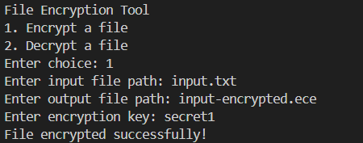
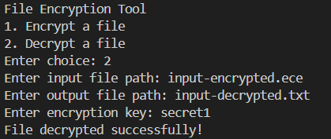

# **File Encryption Tool** 🔐  

A simple C++ program that allows you to **encrypt and decrypt files** using XOR-based encryption.  

## **📌 Features**
- Encrypt any file using a custom key  
- Decrypt encrypted files back to their original form  
- Lightweight and easy to use  
- Works with any file type (text, images, etc.)  

---

## **🛠 How It Works**
This program uses **XOR encryption**, where each byte in the file is **XOR-ed** with a key character. Since XOR is reversible, using the same key for decryption restores the original file.  

📌 **Important:** The encryption key must be the same when decrypting the file, or else the output will be unreadable.  

---

## **💻 Installation & Usage**
### **1️⃣ Clone the Repository**
```sh
git clone https://github.com/yourusername/FileEncryptionTool.git
cd FileEncryptionTool
```
### **2️⃣ Compile the Project**
Using g++:
```sh
g++ -o file_encryption_tool src/main.cpp src/encryptor.cpp src/decryptor.cpp src/utils.cpp
```
Or using make:
```sh
make
```
### **3️⃣ Run the Program**
To encrypt a file:
```sh
./file_encryption_tool
```
and then follow the instructions.

---

## **📸 Screenshots**
Here are some screenshots demonstrating how the tool works:

1️⃣ **Original Input File:**  

   

2️⃣ **Encrypting the File:**  

   

3️⃣ **Encrypted File Output:**  

   

4️⃣ **Decrypting the File:**  

   

5️⃣ **Decrypted File Output:**  

   

---

## 📜 License
This project is open-source. Feel free to modify and improve! 🎉

---
**Made with ❤️ by ArshLabs**
